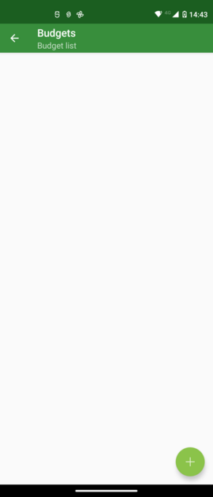

Budgets are used to set up monthly or yearly amounts and compare budgeted values with both expenses and forecasts.

# Setting Up a Budget

From the initial budget screen, press the "+" button to add a new budget.

Enter the year and optionally the month (if you want to have a monthly budget).

Your budget will appear in the list. Select it.

## Operating with a Budget
A long press on the budget name will display a context menu where you can edit (change year/month) or delete it. Deleting a budget will not affect your transactions; only the budget itself will be modified or deleted.

# Managing Budgets
Budget Details show all categories with budget, actual, and forecast information.

From the upper-right gear icon, you can:
- **Reload scheduled transactions**: This forces a reload from your recurring transactions and evaluates their impact on the budget.
- **Show simple budget view**: This displays a simplified view of the budget.
- **Use financial year**: This allows you to compare the budget to a financial year (useful if your budget period doesn't align with the calendar year). See the app settings for details regarding the financial year.
- **Select visible columns**: This lets you choose which columns will be visible in the list. Available columns are:
  - **Frequency**: Indicates how often the budget value applies. Currently, on mobile, while all frequencies are supported if entered from the desktop version, this is tied to the budget type. For a Yearly budget, the frequency is Year; for a Monthly budget, the frequency is monthly. Refer to the desktop version for more information.
  - **Amount**: The budgeted amount.
  - **Estimate**: The computed value for the period. For example, if you have a Weekly frequency of €10 and are in a Yearly budget, the value shown is €520 (52 * €10).
  - **Actual**: The total expenses for this category within the budget period. This value comes from your transactions.
  - **Available**: The remaining amount, calculated as **Estimate** - **Actual**.
  - **Forecast Remain**: The projected remaining amount, calculated as **Estimate** - **Actual** - **[sum of recurring transactions within the budget period]**.

## Setting Up Category Budgets

From the budget category list, a long press on a category allows you to:
- **Edit**: Set up or modify the budget **Amount**.
- **Delete**: Remove the budget information for that category.
- **View Transactions**: See the transactions that contribute to the "**Actual**" value.

Choosing "**Edit**" will allow you to set a value for that category relative to the budget.

Use $${\color{red}negative}$$ values for expenses and $${\color{green}positive}$$ values for income. For example, setting *Salary* to "+€12,000" in a Yearly budget means that you receive €1,000 per month.

## table for frequency
This are all supported frequency from desktop.

**Notice** Due to current limitations on the Android Budget feature, the budget frequency is tied to the budget type. For Yearly budgets, the frequency is "Yearly," and for Monthly budgets, it's "Monthly." If you need to set up different values, please use the desktop version for now. Android can read different frequencies but cannot currently set them.
{: .notice--warning}

| Key    | new occurs | Result for Year | Result for Month |
| -------|------------|-----------------| ---- |
| None            | 0          | amount * 0      | 0 (ok) |
| Weekly          | 52         | amount * 52     | amount * 52  / 12 = amount * 4,33 (ok)   |
| Fortnightly     | 26         | amount * 26     | amount * 26  / 12 = amount * 2,16 (ok)   |
| Monthly         | 12         | amount * 12     | amount * 12  / 12 = amount (ok)          |
| Every 2 Months  | 6          | amount * 6      | amount * 6   / 12 = amount / 2 (ok)      |
| Quarterly       | 4          | amount * 4      | amount * 4   / 12 = amount / 3 (ok)      |
| Half-Yearly     | 2          | amount * 2      | amount * 2   / 12 = amount / 6 (ok)      |
| Yearly          | 1          | amount * 1      | amount * 1   / 12 = amount / 12 (ok)     |
| Daily           | 365        | amount * 365    | amount * 365 / 12 = amount * 30,41 (ok)  |

